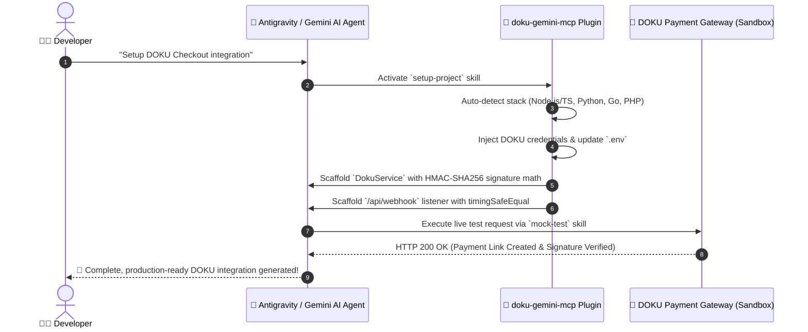

# DOKU Gemini MCP Plugin (`doku-gemini-mcp`)

[](https://github.com/roedyrustam/doku-gemini-mcp)
[](https://opensource.org/licenses/MIT)
[](https://developers.doku.com/)
[](https://modelcontextprotocol.io/)

> **Official Antigravity / Gemini Plugin & MCP Server Integration for DOKU Payment Gateway (Jokul API v2 & SNAP API v1.0)**  
> *Panduan & Ekstensi AI Agentic Commerce untuk Integrasi DOKU Payment Gateway & Server Model Context Protocol.*

[English](#english) | [Bahasa Indonesia](#bahasa-indonesia) | [Documentation Index](#documentation-index)

---

## ⚡ 1-Command Agentic Workflow Architecture

```text
┌────────────────────────────────────────────────────────────────────────────────────────────────────────┐
│                                 1-COMMAND AGENTIC INTEGRATION WORKFLOW                                 │
├────────────────────────────────────────────────────────────────────────────────────────────────────────┤
│                                                                                                        │
│   USER PROMPT: "Setup DOKU integration for my app"                                                     │
│                                                                                                        │
│        │                                                                                               │
│        ▼                                                                                               │
│   ┌────────────────────────┐    Auto-detects language, framework, & package manager                    │
│   │ 1. detect-stack        ├─────────────────────────────────────────────────────────────┐             │
│   └───────────┬────────────┘                                                           │             │
│               │                                                                        │             │
│               ▼                                                                        ▼             │
│   ┌────────────────────────┐    Injects DOKU_CLIENT_ID & DOKU_SECRET_KEY               ┌──────────┐  │
│   │ 2. setup-credentials   ├──────────────────────────────────────────────────────────►│  .env    │  │
│   └───────────┬────────────┘                                                           └──────────┘  │
│               │                                                                                      │
│               ▼                                                                                      │
│   ┌────────────────────────┐    Scaffolds DokuService with Base64 SHA-256 Digest &                      │
│   │ 3. setup-project       ├─────────────────────────────────────────────────────────────┐             │
│   └───────────┬────────────┘    HMAC-SHA256 Signature calculation                      │             │
│               │                                                                        ▼             │
│               ▼                                                                 ┌─────────────┐      │
│   ┌────────────────────────┐    Scaffolds Webhook Listener with                 │ DokuService │      │
│   │ 4. webhook-receiver    ├───────────────────────────────────────────────►└──────┬──────┘      │
│   └───────────┬────────────┘    timingSafeEqual & Idempotency Guard                    │             │
│               │                                                                        ▼             │
│               ▼                                                                 ┌─────────────┐      │
│   ┌────────────────────────┐    Executes live test request against Sandbox API  │ Webhook Route│     │
│   │ 5. mock-test           ├───────────────────────────────────────────────────►└─────────────┘      │
│   └────────────────────────┘    Returns HTTP 200 OK & Verified Payment Link!                         │
│                                                                                                        │
└────────────────────────────────────────────────────────────────────────────────────────────────────────┘
```



---

<a name="english"></a>
## English

### Overview
`doku-gemini-mcp` is an advanced AI plugin and Model Context Protocol (MCP) server for **Google Antigravity**, **Gemini**, **Claude Desktop**, and **Cursor**. It equips AI coding assistants with end-to-end capabilities to scaffold, configure, test, sign, and maintain [DOKU Payment Gateway](https://developers.doku.com/) integrations.

Whether you are implementing DOKU Checkout, Direct Virtual Accounts (BCA, Mandiri, BRI, BNI, Permata, Danamon, CIMB), QRIS (Jokul & SNAP), E-Wallets (OVO, ShopeePay, DANA, LinkAja), Credit Cards, Direct Debit, PayLater, or Online Refunds, this plugin provides automated agentic workflows, cryptographic HMAC-SHA256 & SNAP signature generators, webhook verifiers, and production security readiness checks.

### Key Capabilities
- **11 Specialized Agentic Skills**: Automated stack detection, project setup, credential configuration, postman collection generation, live sandbox testing, and production audits.
- **DOKU MCP Server**: Native Model Context Protocol server enabling AI agents to execute autonomous checkout and refund operations (AI Agentic Commerce).
- **Cryptographic Strictness**: Built-in HMAC-SHA256 & SNAP HMAC-SHA512 request signature calculators and webhook notification validators adhering to official DOKU specifications.
- **Multi-Language Support**: Scaffolding code for Node.js / TypeScript, Python, Go, PHP, Java, and Rust.
- **Production Readiness Suite**: 8-point automated pre-go-live checklist preventing security vulnerabilities and data leakage.

---

<a name="bahasa-indonesia"></a>
## Bahasa Indonesia

### Ringkasan
`doku-gemini-mcp` adalah plugin AI dan server Model Context Protocol (MCP) tingkat lanjut untuk **Google Antigravity**, **Gemini**, **Claude Desktop**, dan **Cursor**. Plugin ini membekali asisten AI dengan kemampuan end-to-end untuk membuat, mengonfigurasi, menguji, menandatangani, dan memelihara integrasi [DOKU Payment Gateway](https://developers.doku.com/).

Baik Anda mengimplementasikan DOKU Checkout, Virtual Account Langsung (BCA, Mandiri, BRI, BNI, Permata, Danamon, CIMB), QRIS (Jokul & SNAP), E-Wallet (OVO, ShopeePay, DANA, LinkAja), Kartu Kredit, Direct Debit, PayLater, maupun Online Refund, plugin ini menyediakan alur kerja agen otomatis, generator signature HMAC-SHA256 & SNAP kriptografis, verifikator webhook, dan pemeriksaan kesiapan keamanan produksi.

### Fitur Utama
- **11 Skill Agen Terpesialisasi**: Deteksi stack otomatis, setup proyek, konfigurasi kredensial, pembuat koleksi Postman, penguji sandbox langsung, dan audit produksi.
- **DOKU MCP Server**: Server Model Context Protocol asli yang memungkinkan agen AI menjalankan transaksi checkout & refund otonom (*AI Agentic Commerce*).
- **Ketepatan Kriptografis**: Kalkulator signature permintaan HMAC-SHA256 & SNAP HMAC-SHA512 bawaan dan validator notifikasi webhook yang mematuhi spesifikasi resmi DOKU.
- **Dukungan Multi-Bahasa**: Kode scaffolding untuk Node.js / TypeScript, Python, Go, PHP, Java, dan Rust.
- **Rangkaian Kesiapan Produksi**: 8 poin checklist otomatis sebelum *go-live* untuk mencegah kerentanan keamanan dan kebocoran data.


---

## Installation & Setup for Antigravity IDE & Gemini CLI

### Option A: Global Installation (Recommended)

Installing the plugin globally allows **Antigravity IDE** and **Gemini CLI** to automatically discover all 11 skills and security rules across all your workspaces without extra configuration.

#### 1. Clone to Global Plugin Root
- **Windows (PowerShell)**:
  ```powershell
  git clone https://github.com/roedyrustam/doku-gemini-mcp.git "$env:USERPROFILE\.gemini\config\plugins\doku-gemini-mcp"
  ```
- **macOS / Linux / WSL (Bash)**:
  ```bash
  git clone https://github.com/roedyrustam/doku-gemini-mcp.git ~/.gemini/config/plugins/doku-gemini-mcp
  ```

#### 2. Auto-Discovery Verification
Once cloned into `~/.gemini/config/plugins/doku-gemini-mcp`, Antigravity IDE will automatically detect:
- `plugin.json` metadata & rules (`AGENTS.md`, `rules/*.md`).
- All 11 specialized skills under `skills/`.

---

### Option B: Workspace-Specific Installation

If you prefer to include the plugin directly inside a specific project repository:

1. Create a `.agents` folder in your project root:
   ```bash
   mkdir -p .agents/plugins
   ```
2. Clone the repository into `.agents/plugins`:
   ```bash
   git clone https://github.com/roedyrustam/doku-gemini-mcp.git .agents/plugins/doku-gemini-mcp
   ```

---

### Option C: DOKU MCP Server Registration

To enable **AI Agentic Commerce** (allowing the AI agent to generate payment links, issue Virtual Accounts, and generate QRIS codes autonomously via MCP tools):

#### 1. Copy or update `mcp_config.json`
- **Antigravity IDE**: Place in `~/.gemini/antigravity-ide/mcp_config.json`
- **Claude Desktop**: Place in `%APPDATA%\Claude\claude_desktop_config.json` (Windows) or `~/Library/Application Support/Claude/claude_desktop_config.json` (macOS).

#### 2. Configuration Example
```json
{
  "mcpServers": {
    "doku": {
      "command": "node",
      "args": ["C:/Users/YOUR_USER/.gemini/config/plugins/doku-gemini-mcp/dist/index.js"],
      "env": {
        "DOKU_CLIENT_ID": "YOUR_SANDBOX_CLIENT_ID",
        "DOKU_SECRET_KEY": "YOUR_SANDBOX_SECRET_KEY",
        "DOKU_IS_PRODUCTION": "false"
      }
    }
  }
}
```

> [!TIP]
> Retrieve your Sandbox Client ID and Secret Key from [DOKU Sandbox Back Office](https://sandbox.doku.com/bo/login).  
> Test payments and webhooks using [DOKU Integration Payment Simulator](https://sandbox.doku.com/integration/simulator/).

---

## Directory Structure

```text
doku-gemini-mcp/
├── README.md                           # Master Documentation & Quick Start
├── AGENTS.md                           # Mandatory Security Rules & Signature Specifications
├── plugin.json                         # Plugin Metadata & Keywords
├── gemini-extension.json               # Gemini Extension Specification
├── mcp_config.json                     # MCP Client Configuration Template
├── docs/                               # Deep-Dive Technical Guides
│   ├── SKILLS_GUIDE.md                 # Complete Guide to all 11 Skills
│   ├── HMAC_SIGNATURE_GUIDE.md         # HMAC-SHA256 Math & Code Implementation Guide
│   ├── MCP_SERVER_GUIDE.md             # DOKU MCP Server Architecture & Setup
│   ├── WEBHOOK_GUIDE.md                # Webhook Verification & Idempotency Guard
│   └── PRODUCTION_CHECKLIST.md         # 8-Point Go-Live Production Readiness Audit
├── rules/                              # Modular Rules
│   ├── doku-security-rules.md          # Security & Credentials Guardrails
│   └── mcp-tool-rules.md               # MCP Tool Design Standards
└── skills/                             # 11 Specialized Agentic Skills
    ├── setup-project/                  # Main entry point for project scaffolding
    ├── detect-stack/                   # Programming language & framework detector
    ├── setup-credentials/              # Secure DOKU credential setup
    ├── doku-payment-gateway/           # Core Jokul API v2 reference guide
    ├── webhook-receiver/               # HTTP Webhook listener generator
    ├── doku-mcp-server/                # DOKU MCP Agentic Commerce server guide
    ├── mock-test/                      # Live Sandbox API & signature test runner
    ├── generate-postman/               # Postman Collection v2.1 exporter with pre-request scripts
    ├── production-checklist/           # 8-step pre-go-live readiness auditor
    ├── fetch-api-spec/                 # Official DOKU API spec fetcher
    └── upgrade/                        # API spec diffing & upgrade patcher
```

---

## Specialized Skills Reference

| Skill Name | Purpose / Deskripsi | Target Stack |
|---|---|---|
| [`setup-project`](file:///c:/Users/roedy/.gemini/config/plugins/doku-gemini-mcp/skills/setup-project/SKILL.md) | Main entry point — scaffolds complete DOKU Payment Gateway integration | Node, Python, Go, PHP, Java |
| [`detect-stack`](file:///c:/Users/roedy/.gemini/config/plugins/doku-gemini-mcp/skills/detect-stack/SKILL.md) | Detects language, framework, ORM, and environment structure | All Stacks |
| [`setup-credentials`](file:///c:/Users/roedy/.gemini/config/plugins/doku-gemini-mcp/skills/setup-credentials/SKILL.md) | Safely configures DOKU Client ID, Secret Key, and Environment | `.env`, Config Files |
| [`doku-payment-gateway`](file:///c:/Users/roedy/.gemini/config/plugins/doku-gemini-mcp/skills/doku-payment-gateway/SKILL.md) | Primary reference for Jokul API v2, endpoints, and HMAC signatures | All APIs |
| [`webhook-receiver`](file:///c:/Users/roedy/.gemini/config/plugins/doku-gemini-mcp/skills/webhook-receiver/SKILL.md) | Scaffolds webhook endpoint with signature verification & anti-replay idempotency | Express, Fastify, FastAPI, Gin |
| [`doku-mcp-server`](file:///c:/Users/roedy/.gemini/config/plugins/doku-gemini-mcp/skills/doku-mcp-server/SKILL.md) | Configures DOKU MCP server for AI Agentic Commerce | TypeScript, Python |
| [`mock-test`](file:///c:/Users/roedy/.gemini/config/plugins/doku-gemini-mcp/skills/mock-test/SKILL.md) | Validates HMAC-SHA256 signature calculations against DOKU Sandbox | Sandbox APIs |
| [`generate-postman`](file:///c:/Users/roedy/.gemini/config/plugins/doku-gemini-mcp/skills/generate-postman/SKILL.md) | Exports Postman Collection v2.1 with automatic pre-request signature scripts | Postman v2.1 |
| [`production-checklist`](file:///c:/Users/roedy/.gemini/config/plugins/doku-gemini-mcp/skills/production-checklist/SKILL.md) | Runs 8 mandatory security and stability checks before deployment | Production Deployment |
| [`fetch-api-spec`](file:///c:/Users/roedy/.gemini/config/plugins/doku-gemini-mcp/skills/fetch-api-spec/SKILL.md) | Scrapes and stores official DOKU API specs locally | OpenAPI / JSON Spec |
| [`upgrade`](file:///c:/Users/roedy/.gemini/config/plugins/doku-gemini-mcp/skills/upgrade/SKILL.md) | Diffs existing code against latest spec and applies non-breaking patches | Upgrades |

---

## Quick Start: DOKU HMAC-SHA256 Signature

DOKU Payment Gateway requires cryptographic HMAC-SHA256 HTTP headers for all requests.

### 1. Mandatory HTTP Headers
- `Client-Id`: Merchant Client ID from DOKU Back Office.
- `Request-Id`: Unique UUID v4 string per request.
- `Request-Timestamp`: UTC ISO8601 string **without milliseconds** (e.g. `2026-08-09T00:00:00Z`).
- `Request-Target`: Target URI path (e.g. `/checkout/v1/payment` or `/doku-virtual-account/v2/payment-code`).
- `Digest`: Base64 encoded SHA-256 hash of raw JSON body (Omitted for `GET` requests).
- `Signature`: Format `HMACSHA256=<base64-signature>`.

### 2. Signature Assembly String Formula
```text
Client-Id:<CLIENT_ID>\nRequest-Id:<REQUEST_ID>\nRequest-Timestamp:<TIMESTAMP>\nRequest-Target:<TARGET_PATH>\nDigest:<DIGEST_STRING>
```
> [!CAUTION]
> Do NOT add a trailing newline (`\n`) at the end of the raw component string.  
> For `GET` requests (e.g. `/orders/v1/status/:invoice_number`), omit `\nDigest:<DIGEST_STRING>`.

### 3. Node.js / TypeScript Example
```typescript
import crypto from 'crypto';

export function calculateDokuSignature(params: {
  clientId: string;
  secretKey: string;
  requestId: string;
  timestamp: string; // e.g. "2026-08-09T00:00:00Z"
  targetPath: string; // e.g. "/checkout/v1/payment"
  body?: object;
}): { digest?: string; signature: string } {
  let digestString = '';
  
  if (params.body && Object.keys(params.body).length > 0) {
    const jsonBody = JSON.stringify(params.body);
    const bodyHash = crypto.createHash('sha256').update(jsonBody, 'utf8').digest();
    digestString = bodyHash.toString('base64');
  }

  let componentString = `Client-Id:${params.clientId}\nRequest-Id:${params.requestId}\nRequest-Timestamp:${params.timestamp}\nRequest-Target:${params.targetPath}`;
  
  if (digestString) {
    componentString += `\nDigest:${digestString}`;
  }

  const hmac = crypto.createHmac('sha256', params.secretKey);
  hmac.update(componentString, 'utf8');
  const signature = `HMACSHA256=${hmac.digest('base64')}`;

  return { digest: digestString || undefined, signature };
}
```

---

## DOKU MCP Server Integration

Enable your AI assistant (Antigravity, Gemini, Claude Desktop, Cursor) to execute autonomous payment operations using the Model Context Protocol.

### Server Tools Matrix
- `create_checkout_payment`: Generate DOKU Checkout Payment Link URL.
- `create_virtual_account`: Generate Bank Virtual Account numbers (BCA, Mandiri, BRI, BNI, Permata, etc.).
- `create_qris_payment`: Generate dynamic QRIS payment codes & QR images.
- `create_ewallet_payment`: Initiate E-Wallet charges (OVO, ShopeePay, DANA, LinkAja).
- `check_transaction_status`: Query payment invoice status from DOKU API.
- `process_refund`: Initiate online refunds for paid orders.


### Configuration (`mcp_config.json`)
```json
{
  "mcpServers": {
    "doku": {
      "command": "node",
      "args": ["/path/to/doku-gemini-mcp/dist/index.js"],
      "env": {
        "DOKU_CLIENT_ID": "YOUR_SANDBOX_CLIENT_ID",
        "DOKU_SECRET_KEY": "YOUR_SANDBOX_SECRET_KEY",
        "DOKU_IS_PRODUCTION": "false"
      }
    }
  }
}
```

---

## Documentation Index

Explore detailed technical guides in the [`docs/`](file:///c:/Users/roedy/.gemini/config/plugins/doku-gemini-mcp/docs) directory:

1. 📖 [**Skills Comprehensive Guide (`SKILLS_GUIDE.md`)**](file:///c:/Users/roedy/.gemini/config/plugins/doku-gemini-mcp/docs/SKILLS_GUIDE.md)  
   Detailed manual and trigger instructions for all 11 agentic skills.
2. 🔐 [**HMAC Signature Deep Dive (`HMAC_SIGNATURE_GUIDE.md`)**](file:///c:/Users/roedy/.gemini/config/plugins/doku-gemini-mcp/docs/HMAC_SIGNATURE_GUIDE.md)  
   Mathematical breakdown, header specifications, and code implementations in TS, Python, Go, PHP, and Rust.
3. 🤖 [**MCP Server Guide (`MCP_SERVER_GUIDE.md`)**](file:///c:/Users/roedy/.gemini/config/plugins/doku-gemini-mcp/docs/MCP_SERVER_GUIDE.md)  
   Complete guide to building, configuring, and extending the DOKU Model Context Protocol Server for AI Agentic Commerce.
4. 🔔 [**Webhook & Anti-Replay Guide (`WEBHOOK_GUIDE.md`)**](file:///c:/Users/roedy/.gemini/config/plugins/doku-gemini-mcp/docs/WEBHOOK_GUIDE.md)  
   Cryptographic signature verification on HTTP notifications, timing-safe equality, atomic database transactions, and idempotency guards.
5. 🚀 [**Production Readiness Checklist (`PRODUCTION_CHECKLIST.md`)**](file:///c:/Users/roedy/.gemini/config/plugins/doku-gemini-mcp/docs/PRODUCTION_CHECKLIST.md)  
   8-point audit covering credential isolation, HTTPS enforcement, PII log sanitization, rate limiting, and go-live deployment.

---

## Security & Credentials Safety Policy (`AGENTS.md`)

- **NEVER** hardcode `DOKU_CLIENT_ID` or `DOKU_SECRET_KEY` in source code or repositories.
- **ALWAYS** inject API credentials via environment variables (`process.env.DOKU_CLIENT_ID`, `process.env.DOKU_SECRET_KEY`).
- Maintain separate credentials for **Sandbox** (`https://api-sandbox.doku.com` | Back Office: `https://sandbox.doku.com/bo/login`) and **Production** (`https://api.doku.com` | Back Office: `https://dashboard.doku.com`).
- Always use `crypto.timingSafeEqual` when verifying incoming HTTP webhook signatures to prevent timing side-channel attacks.

---

## License

This project is released under the [MIT License](LICENSE).  
Developed by [Roedy Rustam](https://github.com/roedyrustam).
