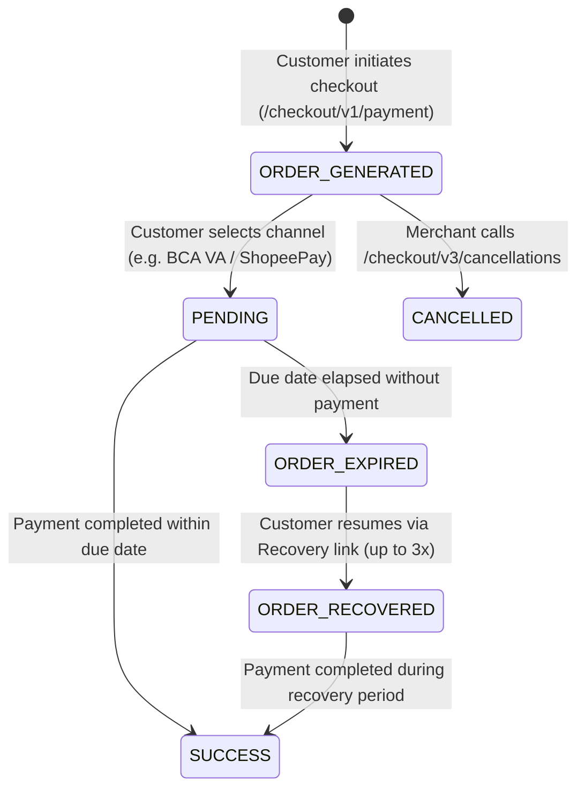

# DOKU Checkout Integration / Integrasi DOKU Checkout

[English](#english) | [Bahasa Indonesia](#bahasa-indonesia)

---

<a name="english"></a>
## English

### Description
Expert guide for implementing **DOKU Checkout** hosted & modal payment solutions based on official [DOKU Developers Documentation](https://developers.doku.com/accept-payments/doku-checkout). DOKU Checkout allows merchants to accept payments from multiple payment channels (Virtual Account, QRIS, E-Wallet, Credit Card, Direct Debit, PayLater, Convenience Store, Digital Banking, and Kartu Kredit Indonesia) with a single integration flow.

### Trigger Conditions
Activate this skill when the user is:
- Integrating or configuring DOKU Checkout (`/checkout/v1/payment`) in Node.js, TypeScript, Python, Go, PHP, or Java.
- Implementing frontend embedding with `jokul-checkout-1.0.0.js` (Pop-up Modal Overlay) or full-page Redirect mode.
- Implementing the **Cancel Order API** (`POST /checkout/v3/cancellations`) to void unpaid Virtual Account or QRIS checkout orders.
- Tracking order-level status (`ORDER_GENERATED`, `ORDER_EXPIRED`, `ORDER_RECOVERED`) via the Check Status API or Dashboard Checkout Report.
- Configuring **Recover Abandoned Cart** (`order.recover_abandoned_cart`, `order.expired_recovered_cart`) for VA, O2O, and Credit Card.
- Filtering and ordering payment channels via `payment.payment_method_types`.
- Customizing checkout callbacks (`callback_url`, `callback_url_result`, `callback_url_cancel`, `auto_redirect`).

---

### Core Architecture & Endpoints

| Environment | Checkout Initiate Endpoint | Cancel Order Endpoint | Frontend JS Library |
|---|---|---|---|
| **Sandbox** | `POST https://api-sandbox.doku.com/checkout/v1/payment` | `POST https://api-sandbox.doku.com/checkout/v3/cancellations` | `https://sandbox.doku.com/jokul-checkout-js/v1/jokul-checkout-1.0.0.js` |
| **Production** | `POST https://api.doku.com/checkout/v1/payment` | `POST https://api.doku.com/checkout/v3/cancellations` | `https://jokul.doku.com/jokul-checkout-js/v1/jokul-checkout-1.0.0.js` |

#### Mandatory HTTP Request Headers (Jokul v2 Standard)
All DOKU Checkout API calls require standard Jokul v2 HMAC-SHA256 headers:
```http
Client-Id: <DOKU_CLIENT_ID>
Request-Id: <UUID_V4>
Request-Timestamp: <UTC_ISO8601_WITHOUT_MS>
Signature: HMACSHA256=<BASE64_HMAC_SHA256>
```

- **Request-Timestamp**: Must be in UTC format without milliseconds, e.g. `2026-08-09T00:00:00Z` (`new Date().toISOString().replace(/\.\d{3}Z$/, 'Z')`).
- **Signature Component String**:
  ```text
  Client-Id:<CLIENT_ID>\nRequest-Id:<REQUEST_ID>\nRequest-Timestamp:<TIMESTAMP>\nRequest-Target:<TARGET_PATH>\nDigest:<DIGEST_STRING>
  ```
  *Note: For `POST /checkout/v1/payment`, `Request-Target` is `/checkout/v1/payment`.*

---

### 1. Backend Integration: Initiate Payment (`POST /checkout/v1/payment`)

#### A. Basic Request Payload
Minimal payload for simple Virtual Account, QRIS, Credit Card, or E-Wallet transactions:
```json
{
  "order": {
    "amount": 50000,
    "invoice_number": "INV-20260904-0001"
  },
  "payment": {
    "payment_due_date": 60
  }
}
```

#### B. Full Request Payload
Full configuration including multi-callbacks, line items, customer PII, and channel filtering:
```json
{
  "order": {
    "amount": 80000,
    "invoice_number": "INV-1720752332",
    "currency": "IDR",
    "callback_url": "https://merchant.com/orders/checkout",
    "callback_url_result": "https://merchant.com/orders/result",
    "callback_url_cancel": "https://merchant.com/orders/cancel",
    "language": "EN",
    "auto_redirect": true,
    "disable_retry_payment": true,
    "recover_abandoned_cart": true,
    "expired_recovered_cart": 1440,
    "line_items": [
      {
        "id": "ITEM-001",
        "name": "Fresh Flowers",
        "quantity": 1,
        "price": 40000,
        "sku": "FF-01",
        "category": "gifts-and-flowers",
        "url": "https://merchant.com/products/flowers",
        "image_url": "https://merchant.com/images/flowers.png",
        "type": "Physical"
      },
      {
        "id": "ITEM-002",
        "name": "Cotton T-Shirt",
        "quantity": 1,
        "price": 40000,
        "sku": "TS-01",
        "category": "clothing",
        "url": "https://merchant.com/products/tshirt",
        "image_url": "https://merchant.com/images/tshirt.png",
        "type": "Physical"
      }
    ]
  },
  "payment": {
    "payment_due_date": 60,
    "type": "SALE",
    "payment_method_types": [
      "VIRTUAL_ACCOUNT_BCA",
      "VIRTUAL_ACCOUNT_BANK_MANDIRI",
      "VIRTUAL_ACCOUNT_BRI",
      "VIRTUAL_ACCOUNT_BNI",
      "QRIS",
      "CREDIT_CARD",
      "GOOGLE_PAY",
      "EMONEY_OVO",
      "EMONEY_SHOPEE_PAY",
      "EMONEY_DANA",
      "PEER_TO_PEER_KREDIVO",
      "PEER_TO_PEER_AKULAKU"
    ]
  },
  "customer": {
    "id": "CUST-001",
    "name": "Budi",
    "last_name": "Santoso",
    "phone": "6281234567890",
    "email": "budi.santoso@example.com",
    "address": "Jl. Sudirman Kav. 10",
    "city": "Jakarta Selatan",
    "state": "DKI Jakarta",
    "postcode": "12190",
    "country": "ID"
  },
  "shipping_address": {
    "first_name": "Budi",
    "last_name": "Santoso",
    "address": "Jl. Sudirman Kav. 10",
    "city": "Jakarta Selatan",
    "postal_code": "12190",
    "phone": "6281234567890",
    "country_code": "IDN"
  },
  "billing_address": {
    "first_name": "Budi",
    "last_name": "Santoso",
    "address": "Jl. Sudirman Kav. 10",
    "city": "Jakarta Selatan",
    "postal_code": "12190",
    "phone": "6281234567890",
    "country_code": "IDN"
  },
  "additional_info": {
    "allow_tenor": [0, 3, 6, 12],
    "override_notification_url": "https://merchant.com/api/doku/webhook"
  }
}
```

#### Field Specifications & Constraints
- `order.amount`: Integer IDR without decimal places. Max length: 12 digits. Sum of line item `(price * quantity)` MUST equal `order.amount`.
- `order.invoice_number`: Max 64 characters. **Warning**: If Credit Card is activated, max length is **30** characters due to acquirer rules. If using Kartu Kredit Indonesia (KKI), symbols are forbidden.
- `order.callback_url`: Configures "Back to Merchant" button on main checkout page. Mandatory for Jenius Pay.
- `order.callback_url_result`: Specific button destination on the final payment result page.
- `order.callback_url_cancel`: Redirection destination when customer cancels order (supported on Indodana).
- `order.auto_redirect`: If `true`, the checkout page automatically redirects to the callback URL after payment without requiring customer to click "Back to Merchant".
- `order.recover_abandoned_cart`: Boolean. Available for VA, O2O, and Credit Card.
- `order.expired_recovered_cart`: Recovery lifespan in minutes (max `44640` minutes / 31 days).
- `payment.payment_due_date`: Expiry time in minutes (default `60` minutes).
- `payment.type`: `"SALE"`, `"INSTALLMENT"`, or `"AUTHORIZE"` (Credit Card only).

#### Response Schema
```json
{
  "message": ["SUCCESS"],
  "response": {
    "order": {
      "amount": "80000",
      "invoice_number": "INV-1720752332",
      "currency": "IDR",
      "session_id": "5f6304ca900144c7a4fcf802ad6c0898"
    },
    "payment": {
      "payment_method_types": ["VIRTUAL_ACCOUNT_BCA", "QRIS", "CREDIT_CARD"],
      "payment_due_date": 60,
      "token_id": "5f6304ca900144c7a4fcf802ad6c089820244512094533497",
      "url": "https://sandbox.doku.com/checkout-link-v2/5f6304ca900144c7a4fcf802ad6c089820244512094533497",
      "expired_date": "20260904104531"
    },
    "uuid": 2225240712094533483107164227326411817850
  }
}
```

---

### 2. Frontend Integration: Displaying the Checkout Page

Merchants can present the checkout page in two modes:

#### Mode 1: Redirect Mode
Directly redirect the customer's browser window to `response.payment.url`:
```typescript
window.location.href = checkoutResponse.response.payment.url;
```

#### Mode 2: Pop-up / Modal Mode (Recommended for seamless UX)
1. Add `<meta name="viewport" content="width=device-width, initial-scale=1">` in `<head>`.
2. Include the DOKU Checkout JS library:
   - **Sandbox**: `<script src="https://sandbox.doku.com/jokul-checkout-js/v1/jokul-checkout-1.0.0.js"></script>`
   - **Production**: `<script src="https://jokul.doku.com/jokul-checkout-js/v1/jokul-checkout-1.0.0.js"></script>`
3. Call `loadJokulCheckout(paymentUrl)`:

```html
<!DOCTYPE html>
<html lang="id">
<head>
  <meta charset="utf-8" />
  <meta name="viewport" content="width=device-width, initial-scale=1" />
  <title>Checkout</title>
  <!-- Load DOKU Checkout JS (Use production in live mode) -->
  <script src="https://sandbox.doku.com/jokul-checkout-js/v1/jokul-checkout-1.0.0.js"></script>
</head>
<body>
  <button id="pay-button">Pay Now</button>

  <script>
    document.getElementById('pay-button').addEventListener('click', async () => {
      // 1. Fetch payment URL from your backend API
      const res = await fetch('/api/checkout', { method: 'POST' });
      const data = await res.json();
      
      // 2. Open DOKU Checkout modal overlay
      if (data?.paymentUrl) {
        loadJokulCheckout(data.paymentUrl);
      }
    });
  </script>
</body>
</html>
```

---

### 3. Cancel Order API (`POST /checkout/v3/cancellations`)

Allows merchants to explicitly cancel an **unpaid** checkout order before the checkout URL expires.
- **Channels Supported**: Virtual Account (excluding BTN, BNC, BPD, OCBC) & QRIS.
- **Condition**: Transactions already paid or expired cannot be cancelled.
- **Activation**: Requires enabling **Order Cancellation** in DOKU Dashboard (*Settings > Checkout Appearance > System Settings > Order Settings*).

#### Request Headers:
Standard Jokul v2 headers with `Request-Target: /checkout/v3/cancellations`.

#### Request Body:
```json
{
  "order": {
    "invoice_number": "INV-20260904-0001"
  },
  "payment": {
    "original_request_id": "fdb69f47-96da-499d-acec-7cdc318ab2fe"
  },
  "note": "Customer changed order item"
}
```

---

### 4. Order Status Lifecycle for Checkout

Checkout orders feature an early order-level lifecycle queryable via `/orders/v1/status/:invoice_number`:



- **`order.status`**:
  - `ORDER_GENERATED`: Order created, checkout link active. Returned by Check Status API even before customer chooses a channel.
  - `ORDER_EXPIRED`: `payment_due_date` elapsed without payment.
  - `ORDER_RECOVERED`: Customer reopened and resumed payment from recovery email.
- **`transaction.status`**: `PENDING`, `SUCCESS`, `FAILED`.

---

### 5. Supported Channel Constants Reference

Use these exact strings in `payment.payment_method_types`:

| Category | Channel Name | Constant Value |
|---|---|---|
| **Virtual Account** | BCA VA | `VIRTUAL_ACCOUNT_BCA` |
| | Bank Mandiri VA | `VIRTUAL_ACCOUNT_BANK_MANDIRI` |
| | Bank Syariah Indonesia (BSI) | `VIRTUAL_ACCOUNT_BANK_SYARIAH_MANDIRI` |
| | BRI VA | `VIRTUAL_ACCOUNT_BRI` |
| | BNI VA | `VIRTUAL_ACCOUNT_BNI` |
| | Permata VA | `VIRTUAL_ACCOUNT_BANK_PERMATA` |
| | CIMB Niaga VA | `VIRTUAL_ACCOUNT_BANK_CIMB` |
| | Danamon VA | `VIRTUAL_ACCOUNT_BANK_DANAMON` |
| | BTN VA | `VIRTUAL_ACCOUNT_BTN` |
| | BNC VA | `VIRTUAL_ACCOUNT_BNC` |
| | BSS VA | `VIRTUAL_ACCOUNT_BSS` |
| | BJB VA | `VIRTUAL_ACCOUNT_BJB` |
| | Sinarmas VA | `VIRTUAL_ACCOUNT_Sinarmas` |
| | DOKU VA | `VIRTUAL_ACCOUNT_DOKU` |
| **Credit Card** | Credit Card (Visa/Mastercard/JCB) | `CREDIT_CARD` |
| | Google Pay | `GOOGLE_PAY` |
| **QRIS** | QRIS (All e-wallets & mobile banking) | `QRIS` |
| **E-Wallet** | OVO | `EMONEY_OVO` |
| | ShopeePay | `EMONEY_SHOPEE_PAY` |
| | DANA | `EMONEY_DANA` |
| | LinkAja | `EMONEY_LINKAJA` |
| | DOKU Wallet | `EMONEY_DOKU` |
| **Convenience Store** | Alfamart Group | `ONLINE_TO_OFFLINE_ALFA` |
| | Indomaret | `ONLINE_TO_OFFLINE_INDOMARET` |
| **PayLater** | Kredivo | `PEER_TO_PEER_KREDIVO` |
| | Akulaku | `PEER_TO_PEER_AKULAKU` |
| | Indodana | `PEER_TO_PEER_INDODANA` |
| **Direct Debit** | BRI Direct Debit | `DIRECT_DEBIT_BRI` |
| **Digital Banking** | Jenius Pay | `JENIUS_PAY` |
| **Kartu Kredit Indonesia**| KKI | `KARTU_KREDIT_INDONESIA` |

---

<a name="bahasa-indonesia"></a>
## Bahasa Indonesia

### Deskripsi
Panduan teknis resmi untuk mengintegrasikan **DOKU Checkout** berdasarkan dokumentasi [DOKU Developers Portal](https://developers.doku.com/accept-payments/doku-checkout). DOKU Checkout memungkinkan merchant menerima pembayaran dari berbagai channel (Virtual Account, QRIS, E-Wallet, Kartu Kredit, Direct Debit, PayLater, Gerai Retail, Digital Banking, dan KKI) melalui satu alur integrasi cepat dan aman.

### Alur Kerja Integrasi
1. **Backend**: Hit API `/checkout/v1/payment` dengan request header Jokul v2 (`Client-Id`, `Request-Id`, `Request-Timestamp`, `Signature: HMACSHA256=...`).
2. **Frontend**: Tampilkan halaman pembayaran DOKU Checkout menggunakan `payment.url` yang diterima:
   - **Mode Pop-up (Modal)**: Muat library `jokul-checkout-1.0.0.js` dan jalankan `loadJokulCheckout(paymentUrl)`.
   - **Mode Redirect**: Arahkan browser pelanggan langsung ke `payment.url`.
3. **Webhook & Notifikasi**: Verifikasi HTTP notification webhook dari DOKU menggunakan HMAC-SHA256 untuk memvalidasi keberhasilan pembayaran sebelum menyelesaikan pesanan.
4. **Pembatalan Pesanan**: Gunakan Cancel Order API (`POST /checkout/v3/cancellations`) untuk membatalkan pesanan unpaid (VA atau QRIS) sebelum masa kedaluwarsa habis.

---
### 🚨 SNAP Integration Mandate (CRITICAL)
**MANDATORY**: For Direct APIs, always follow SNAP BI v1.0 standards. For hosted/modal payment page experiences where DOKU handles multi-channel selection, use DOKU Checkout (`/checkout/v1/payment`) as documented above.

### 🧪 DOKU Sandbox Simulator
Gunakan URL resmi simulator Sandbox DOKU: `https://sandbox.doku.com/integration/simulator/` untuk menguji skenario pembayaran Virtual Account, QRIS, dan E-Wallet.
